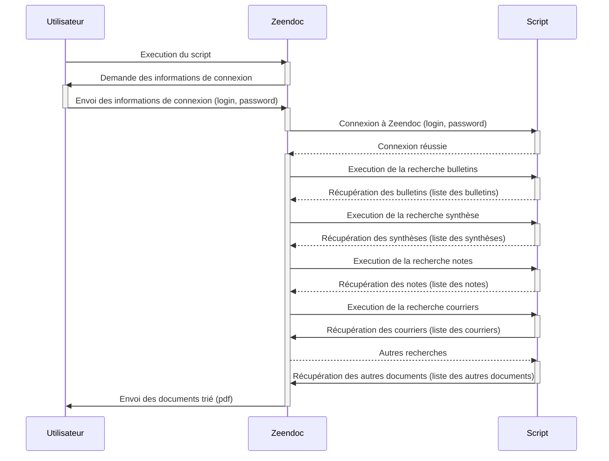
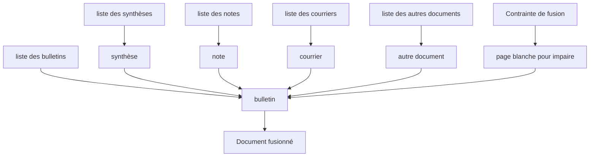

# Fusion-de-documents-RH

## L'idée 

Le client dépose toutes ses pièces dans Zeendoc et les indexe (gabarit ou manuel)
Information obligatoire sur les documents salariés : Type de doc, Prénom et nom du salarié, mois et année du doc
Information obligatoire sur les documents "généraux" : Type de doc, mois et année du doc
Nous paramétrons une recherche enregistrée pour chaque type de documents fusionnables du mois en cours (potentiellement 6)
Un bouton ou un exécutable viendrait déclencher la fusion des documents contenus dans les recherches enregistrées selon l'ordre suivant (à préciser quand nous aurons tous les types de documents) :
Bulletin de paie d'un salarié (attention si le nombre de page est impair, il faut rajouter une page blanche)
Synthèse d'heure du salarié du même mois
Note de service
Courrier du salarié du même mois
etc...
Attention si l'ensemble des éléments fusionnés au dessus forme un nombre de pages impair, on rajoute une page blanche
Puis on recommence avec un nouveau bulletin
Les documents fusionnés seront marqués "imprimé" dans un index statut de fusion, pour qu'ils sortent des recherches enregistrées.

Le PDF "final", n'a pas à être stocké dans Zeendoc, il peut juste être téléchargé sur le poste de l'utilisateur qui déclenche la fusion.


## Estimation du temps de développement

| Tâche                                    | Temps | etat     |
| ---------------------------------------- | ----- | -------- |
| Diagramme de séquence                    | 2h    | fait     |
| Connexion à Zeendoc                      | 3h    | fait     |
| Récupération des recherches enregistrées | 1h    | en cours |
| Récupération des documents               | 1h    |          |
| Tri/fusion des documents                 | 2h    |          |
| Documentation                            | 2h    |          |
| Total                                    | 11h   |          |


## schema UML

## diagramme de séquence



## diagramme pour le traitement des documents

### pour chaque bulletin :





## etapes de développement

- [x] diagramme de séquence
- [x] connexion à zeendoc
- [ ] récupération des documents
- [ ] traitement des documents
- [ ] tri des documents
- [ ] fusion des documents
- [ ] téléchargement des documents
- [ ] documentation


## installation

### prérequis

- python 3.8
- git
- pip

#### installation de python

##### windows :

- télécharger python sur le site officiel : https://www.python.org/ftp/python/3.12.0/python-3.12.0-amd64.exe

##### linux :

- debian/ubuntu : 
```bash
sudo apt install python3.12
```

#### installation de git

##### windows :

- ne pas installer git et passer directement à l'étape suivante

##### linux :

```bash
sudo apt install git
```

#### installation de pip

##### windows :

- pip est installé avec python

##### linux :

```bash
sudo apt install python3-pip
```

### installation du script

#### windows :

- télécharger le script : https://github.com/Mhivelin/Fusion-de-documents-RH
- décompresser le fichier zip

#### linux :

```bash
git clone git@github.com:Mhivelin/Fusion-de-documents-RH.git
```

### installation des dépendances

#### windows :

- ouvrir un terminal dans le dossier du script
- exécuter la commande suivante :
```bash
pip install -r requirements.txt
```

#### linux :

```bash
cd Fusion-de-documents-RH
pip install -r requirements.txt
```


pip install suds-community
