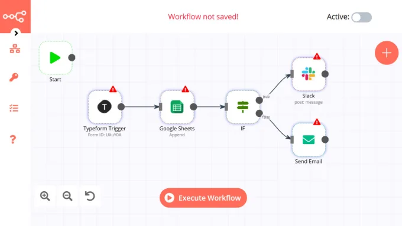

# projets alternance Marius Hivelin
> documentation de mes projets en alternance chez deltic 

## Sommaire
- [export bap Zeendoc--> EBP](#export-bap-zeendoc----ebp)
- [export bap Zeendoc--> SAGE](#export-bap-zeendoc----sage)
- [remontée de paiement EBP--> Zeendoc](#remontée-de-paiement-ebp----zeendoc)
- [remontée de paiement SAGE--> Zeendoc](#remontée-de-paiement-sage----zeendoc)
- [formulaire DED LPO](#formulaire-ded-lpo)
- [Plan de table deltic](#plan-de-table-deltic)
- [Fusion de pdf](#fusion-de-pdf)
- [Charte cybersecurité deltic](#charte-cybersecurité-deltic)
- [Export vers FTP](#export-vers-ftp)
- [Vérification sécurité site Wordpress](#vérification-sécurité-site-wordpress)

## export bap Zeendoc--> EBP
> projet lié a [export bap Zeendoc--> SAGE](#export-bap-zeendoc----sage)
### Présentation
* Ce projet a pour but de permettre un export automatique des factures bonne à payer de Zeendoc vers EBP. il permettra de gagner du temps et d'éviter les erreurs de saisie.
* il sera utilisé par les clients de deltic qui utilisent  EBP et Zeendoc.
* il sera hebergé sur un serveur OVH de deltic.
> facture bonne à payer = facture qui a été validée par le client dans Zeendoc et qui est prête à être payée.

### Versions

> V1 : client individuel (un client = un script)
> 
> V2 : bdd client automatique (un client = une ligne dans une bdd)

### Fonctionnement
> Le script est lancé toutes les heures par une tâche planifiée. il récupère les factures de Zeendoc qui ont l'index BAP et les envoie dans EBP.

**l'index BAP de Zeendoc peut avoir 3 valeurs :**
- &#x2705; OK : la facture est exportée dans  EBP 	
- &#128337; BAP : la facture est prête à être exportée dans  EBP 
- &#x26D4; [vide] : la facture n'est pas exportée dans  EBP 

#### etapes du script (V1)
1. connexion à l'API Zeendoc 
2. récupération des factures avec l'index BAP
3. connexion à l'API EBP
4. validation des factures
5. pas SAGE de l'index BAP à OK

#### etapes du script (V2)
1. connexion à la bdd
2. récupération des clients
3. boucle sur les clients
     1. connexion à l'API Zeendoc 
     2. récupération des factures avec l'index BAP
     3. connexion à l'API EBP
     4. validation des factures
     5. pas SAGE de l'index BAP à OK

### Technologies utilisées
- PHP
- n8n
- docker
  
> n8n est un outil qui permet de créer des workflows. Il est utilisé ici pour récupérer les factures de Zeendoc et les envoyer dans EBP. il permet d'avoir une interface graphique qui permet une lisibilité et une compréhension du code plus facile. comme ci dessous :

### Difficultés rencontrées

- La familiarisation avec la documentation de l'API Zeendoc a été compliquée.
- La documentation de l'API  EBP est très incomplète
- utiliser n8n a été compliqué car il fallait mettre en place un système de tunnel pour que n8n puisse communiquer avec EBP

### Etat du projet

- [x] partie Zeendoc :
  - [x] connexion à Zeendoc 
  - [x] récupération des factures avec l'index BAP
  
- [ ] partie  EBP en cours :
  - [x] connexion à  EBP via postman
  - [ ] connexion à  EBP à terminer (problème de tunnel avec docker)
  - [ ] validation des factures codée mais non testée car pas de connexion à EBP

- [x] documentation (à jour)

  

## export bap Zeendoc--> SAGE

### Présentation
> projet lié a [export bap Zeendoc--> EBP](#export-bap-zeendoc----ebp)
Ce projet a pour but de permettre un export automatique des factures bonne à payer de Zeendoc vers SAGE.

### Fonctionnement
Le script est lancé toutes les heures par une tâche planifiée. il récupère les factures de Zeendoc qui ont l'index BAP et les envoie dans SAGE.

l'index BAP de Zeendoc peut avoir 3 valeurs :
- &#x2705; OK : la facture est exportée dans  SAGE
- &#128337; BAP : la facture est prête à être exportée dans  SAGE
- &#x26D4; [vide] : la facture n'est pas exportée dans  SAGE

#### etapes du script
1. connexion à l'API Zeendoc
2. récupération des factures avec l'index BAP
3. connexion à l'API SAGE
4. validation des factures
5. pas SAGE de l'index BAP à OK
6. envoi des factures dans SAGE
7. mise à jour de l'index BAP à OK

### Technologies utilisées
- PHP
- n8n
- docker

### Etat du projet
- [x] partie Zeendoc :
  - [x] connexion à Zeendoc 
  - [x] récupération des factures avec l'index BAP

- [ ] partie  SAGE en cours :
  - [ ] configuration du serveur  SAGE à terminer
  - [ ] connexion à  SAGE à terminer
  - [ ] validation des factures

## remontée de paiement EBP--> Zeendoc

### Présentation
Ce projet a pour but de permettre une remontée automatique des paiements de  EBP vers Zeendoc. 

### Fonctionnement
Le script est lancé toutes les heures par une tâche planifiée. il récupère les documents de  EBP qui ont été payés et change leur index PAIEMENT de [vide] à OK.

l'index PAIEMENT de Zeendoc peut avoir 2 valeurs :
- &#x2705; OK : le document a été payé
- &#x26D4; [vide] : le document n'a pas été payé

#### etapes du script
1. connexion à l'API EBP
2. récupération des documents payés
3. connexion à l'API Zeendoc
4. mise à jour de l'index PAIEMENT à OK

### Technologies utilisées
- PHP
- n8n
- docker

### Etat du projet
- [x] partie  Zeendoc :
  - [x] connexion à  Zeendoc 
  - [x] récupération des documents avec l'index PAIEMENT
  - [x] mise à jour de l'index PAIEMENT à OK

- [ ] partie  EBP en cours :
  - [ ] connexion à  EBP à terminer
  - [ ] récupération des documents payés
  - [ ] mise à jour de l'index PAIEMENT à OK

## remontée de paiement SAGE--> Zeendoc

## formulaire DED LPO

### Présentation
Ce projet a pour but de créer un formulaire pour les Demandes d'Engagement de Dépenses (DED) de la LPO.

il permettra de remplir un formulaire avec les informations de la DED et de générer un pdf avec ces informations. Les champs de selection seront remplis avec des données récupérées dans la base de données de la LPO ce qui permettra de gagner du temps et d'éviter les erreurs de saisie. le pdf généré sera enregistré sur le serveur dans un dossier et sera aspiré par docuware le nom du pdf sera le numéro de la DED. le ou les devis fournis seront enregistrés dans un autre dossier avec le numéro de la DED et le numéro du devis. 

  **exemple** : 
  | nom                  | contenu       | statut        |
  | -------------------- | ------------- | ------------- |
  | DED-LPO-202300005    | pdf de la DED | 🤖 automatique |
  | DED-LPO-202300005(1) | devis 1       | ✅ obligatoire |
  | DED-LPO-202300005(2) | devis 2       | 🔹 facultatif  |
  | DED-LPO-202300005(3) | devis 3       | 🔹 facultatif  |

ensuite, une extraction automatique sera faite par docuware 

### Fonctionnement
* Le formulaire est créé avec bootstrap, des champs de selection sont remplis avec des données récupérées dans la base de données de la LPO. 
* Un pdf est généré avec les données du formulaire et enregistré dans un fichier sur le serveur pour enfin etre aspriré par docuware.

### Etapes du script
  1. connexion à la base de données de la LPO
  2. récupération des données
  3. remplissage des champs de selection
  4. génération du pdf
  5. enregistrement du pdf sur le serveur
  6. enregistrement du ou des devis dans le dossier
  7. envoi du pdf dans docuware (boulot de docuware)

### Technologies utilisées
- PHP
- Bootstrap
- TCPDF

### Difficultés rencontrées
- la récupération des données dans la base de données de la LPO est compliquée car ils ne m'ont toujours pas donné les accès à la base de données.

### Etat du projet

- [x] création du formulaire
- [ ] récupération des données dans la base de données de la LPO
- [x] récupération des données dans un fichier json
- [x] remplis SAGE des champs de selection avec les données récupérées
- [x] génération du pdf
- [X] enregistrement du pdf sur le serveur
- [X] enregistrement du ou des devis dans le dossier

## Plan de table deltic

### Présentation
Ce projet a pour but de créer un plan de table pour les bureaux de deltic. C'est un petit projet qui m'a permis de me familiariser les serveurs nodejs.

## Fusion de pdf

### résumé du projet

Le client veut déposer chaque mois tout un tas de documents (Bulletins, note de service, courriers, synthèses d'heure, etc...) sur un volume élevé. Ils voudraient avoir un bouton (ou un exécutable) pour télécharger un seul PDF ayant fusionné tous les documents du mois.

L'idée que nous avons :

Le client dépose toutes ses pièces dans Zeendoc et les indexe (gabarit ou manuel)
Information obligatoire sur les documents salariés : Type de doc, Prénom et nom du salarié, mois et année du doc
Information obligatoire sur les documents "généraux" : Type de doc, mois et année du doc
Nous paramétrons une recherche enregistrée pour chaque type de documents fusionnables du mois en cours (potentiellement 6)
Un bouton ou un exécutable viendrait déclencher la fusion des documents contenus dans les recherches enregistrées selon l'ordre suivant (à préciser quand nous aurons tous les types de documents) :
Bulletin de paie d'un salarié (attention si le nombre de page est impair, il faut rajouter une page blanche)
Synthèse d'heure du salarié du même mois
Note de service
Courrier du salarié du même mois
etc...
Attention si l'ensemble des éléments fusionnés au dessus forme un nombre de pages impair, on rajoute une page blanche
Puis on recommence avec un nouveau bulletin
Les documents fusionnés seront marqués "imprimé" dans un index statut de fusion, pour qu'ils sortent des recherches enregistrées.

Le PDF "final", n'a pas à être stocké dans Zeendoc, il peut juste être téléchargé sur le poste de l'utilisateur qui déclenche la fusion.

J'ai essayé de l'illustré dans le PDF Annexe :

### Présentation
Ce projet a pour but de fusionner des pdf dans Zeendoc afin de les imprimer en un seul document.

### Fonctionnement
Le script est lancé via un exécutable. Il récupère tout les documents grace a une recherche dans Zeendoc et les fusionne dans un seul document selon un ordre précis.

### Etapes du script
1. connexion à l'API Zeendoc
2. récupération des documents
3. fusion des documents
4. enregistrement du pdf sur le serveur

#### boucle de fusion des documents

1. Bulletin de paie d'un salarié (attention si le nombre de page est impair, il faut rajouter une page blanche)
2. Synthèse d'heure du salarié du même mois
3. Note de service
4. Courrier du salarié du même mois
5. etc...
6. Attention si l'ensemble des éléments fusionnés au dessus forme un nombre de pages impair, on rajoute une page blanche

### Technologies utilisées
- PHP ou Python

### Difficultés rencontrées

### prérequis

- [ ] connaître l'OS du client
- [ ] savoir si le client a un serveur
- [ ] savoir si les postes peuvent executer des scripts
- [ ] savoir si python est installé sur les postes

### Etat du projet
> pas de lancemant de projet pour le moment en attente de la demande du client

- [x] etude de faisabilité
- [x] réflexion fusion des pdf

## Charte cybersecurité deltic

### Présentation
Ce projet a pour but de créer une charte de cybersécurité pour deltic. C'est un petit projet qui m'a permis de valider mes compétences en cybersécurité et de faire de la prévention auprès des salariés.

### Fonctionnement

### Technologies utilisées
- canva

### Difficultés rencontrées
mise en place des règles de cybersécurité

### Etat du projet
- [x] création de la charte
- [ ] mise en place des règles de cybersécurité

## Export vers FTP

### Présentation
Petit projet qui as permis de rendre service à un client. Il voulait pouvoir exporter des documents vers un FTP.

### Fonctionnement
Le script est lancé via un exécutable. Il récupère tout les documents dans un dossier et les envoie sur un FTP.

### Technologies utilisées
- Python

### Difficultés rencontrées

### Etat du projet
- [x] création du script
- [x] mise en place de l'exécutable

## Vérification sécurité site Wordpress

### Présentation
Ce projet a pour but de vérifier la sécurité du site de deltic.

### Fonctionnement
utilisation des l'outils WPScan/nikto/nmap pour vérifier la sécurité du site.